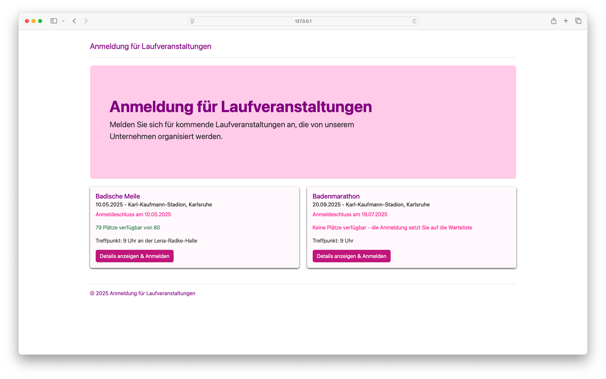
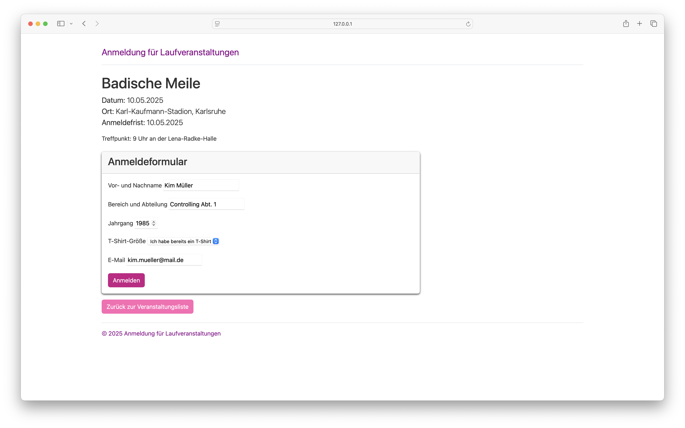
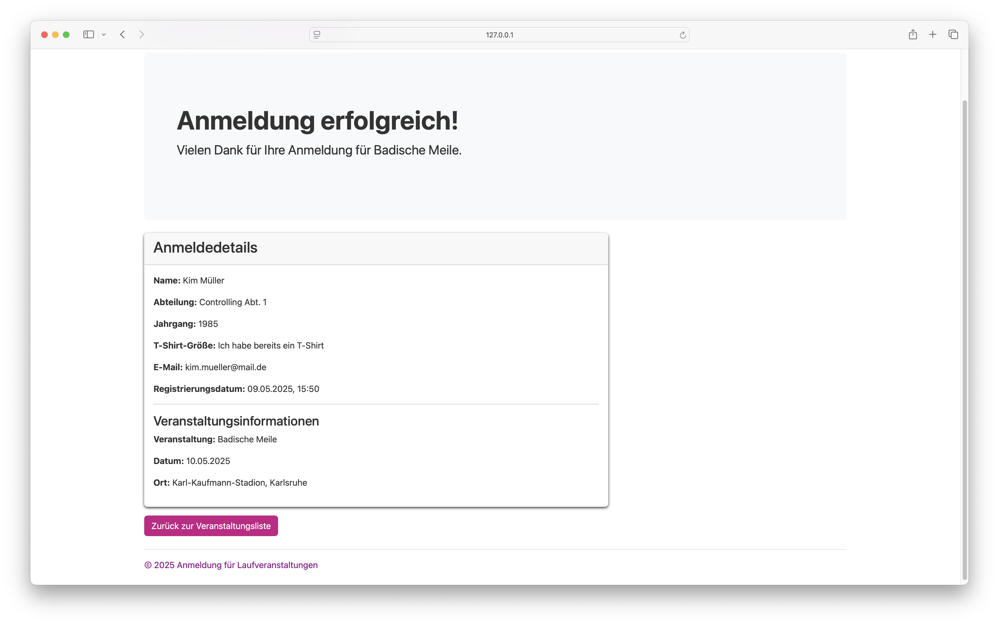
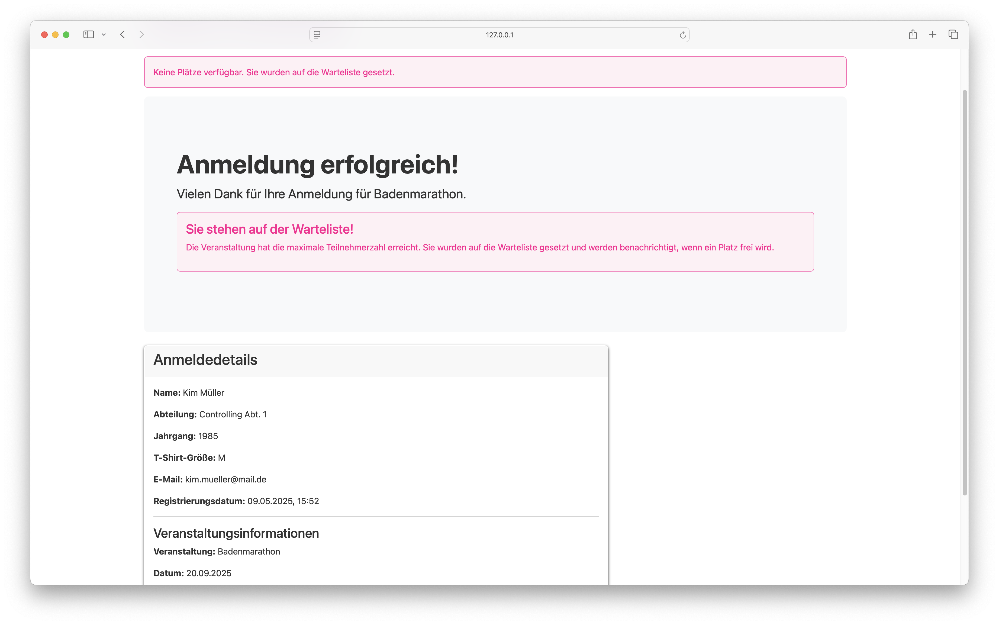
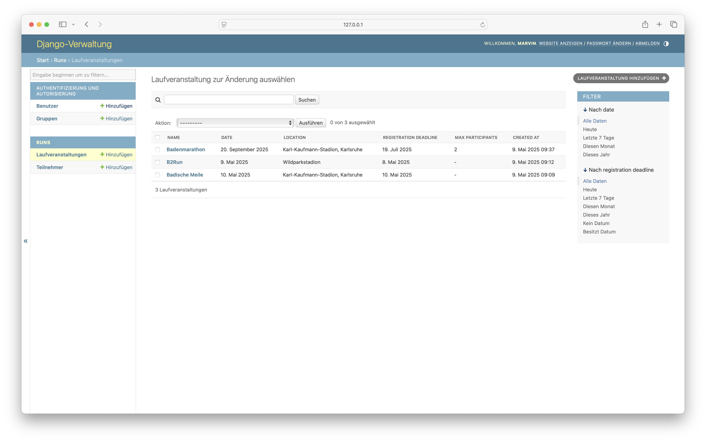
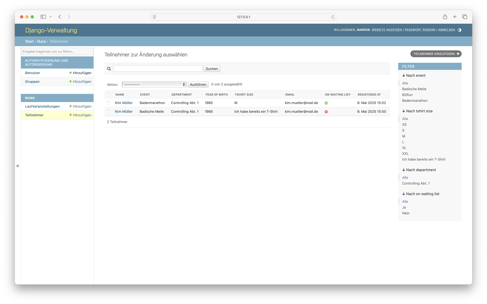

# Running Events Registration

A Django application for managing running event registrations. This application allows administrators to create running events and participants to register for these events.

## Features

- Create and manage running events with details like name, date, location, and description
- Set registration deadlines for events
- Limit the number of participants for events
- Register participants with details like name, department, year of birth, t-shirt size, and email
- Automatically place participants on a waiting list when an event is full
- Prevent duplicate registrations
- View registration details and status

## Screenshots

Here are some screenshots showcasing these features:

### Event List



The event list page displays all available running events as cards. Each card shows the event name, date, location, registration deadline, available spots, and a brief description. The page uses a magenta color scheme with different colors to indicate status: red for deadlines, yellow for waiting list warnings, green for available spots.

### Event Detail and Registration



The event detail page shows comprehensive information about a running event, including the event name, date, location, registration deadline, and available spots. Below that is the full event description. The main part of the page contains a registration form with fields for name, department, year of birth, t-shirt size, and email.

### Registration Success



After successful registration, participants see a confirmation page with their registration details, including name, department, year of birth, t-shirt size, email, and registration date. It also shows the event information, including the event name, date, and location.

### Waiting List Notification



If an event is full, participants are automatically placed on a waiting list. The registration success page shows a warning box explaining that the event has reached its maximum number of participants and that they will be notified if a spot becomes available.

### Admin Interface




The Django admin interface allows administrators to manage running events and participants. It displays a list of running events with columns for name, date, location, and registration deadline. Each event has links to edit or delete it. The admin interface also has a section for managing participants, showing their name, event, department, and registration status.

## Installation

### Prerequisites

- Python 3.11 or higher
- Django 5.2 or higher

### Setup

1. Clone the repository:
   ```bash
   git clone https://github.com/yourusername/running-events-registration.git
   cd running-events-registration
   ```

2. Create and activate a virtual environment:
   ```bash
   python -m venv .venv
   source .venv/bin/activate  # On Windows: .venv\Scripts\activate
   ```

3. Install dependencies:
   ```bash
   pip install -r requirements.txt
   ```

4. Apply migrations:
   ```bash
   python manage.py migrate
   ```

5. Create a superuser:
   ```bash
   python manage.py createsuperuser
   ```

6. Run the development server:
   ```bash
   python manage.py runserver
   ```

7. Access the application at http://127.0.0.1:8000/

## Usage

### Admin Interface

1. Access the admin interface at http://127.0.0.1:8000/admin/
2. Log in using the superuser credentials you created
3. Create running events with the following details:
   - Name
   - Date
   - Location
   - Description
   - Registration deadline (optional)
   - Maximum number of participants (optional)
4. View and manage participant registrations

### Public Interface

1. Visit the homepage at http://127.0.0.1:8000/
2. Browse available running events
3. Click on an event to view details and register
4. Fill out the registration form with your details
5. Submit the form to register for the event
6. If the event is full, you will be placed on a waiting list

## Development

### Settings Structure

This project uses a split settings structure:

- **base.py**: Common settings shared by all environments
- **development.py**: Development-specific settings (DEBUG=True, SQLite, etc.)
- **production.py**: Production-specific settings (DEBUG=False, PostgreSQL, security settings, etc.)

By default, the development settings are used when running the development server.

### Environment Variables

For production, you need to set environment variables. Copy the `.env.example` file to `.env` and update the values:

```bash
cp .env.example .env
# Edit .env with your actual values
```

Required environment variables for production:
- `DJANGO_SECRET_KEY`: A secret key for Django
- `DJANGO_ALLOWED_HOSTS`: Comma-separated list of allowed hosts
- `DB_NAME`, `DB_USER`, `DB_PASSWORD`, `DB_HOST`: Database connection details
- `EMAIL_HOST`, `EMAIL_HOST_USER`, `EMAIL_HOST_PASSWORD`: Email server details

### Code Quality Tools

This project uses several tools to maintain code quality:

- **pre-commit**: Runs checks before each commit
- **black**: Code formatter
- **isort**: Import sorter
- **flake8**: Linter
- **mypy**: Type checker

To set up pre-commit hooks:

```bash
pip install pre-commit
pre-commit install
```

### Running Tests

To run the tests:

```bash
python manage.py test
```

Or to run specific test files:

```bash
python manage.py test runs.tests.test_models
python manage.py test runs.tests.test_views
python manage.py test runs.tests.test_forms
```

### Internationalization and Localization

This project supports multiple languages:

- **Default language**: German (de)
- **Supported languages**: German (de), English (en)

The application's user interface is fully translated and can be displayed in any of the supported languages.

#### Adding or Updating Translations

To add or update translations:

1. Mark strings for translation:
   - In Python files: Use `gettext_lazy as _` from `django.utils.translation`
   - In templates: Use `` or `text`

2. Extract messages to create/update .po files:
   ```bash
   python manage.py makemessages -l de  # For German
   python manage.py makemessages -l en  # For English
   ```

3. Edit the .po files in the `locale/<language_code>/LC_MESSAGES/` directory to add translations

4. Compile the translations:
   ```bash
   python manage.py compilemessages
   ```

#### Switching Languages

Users can switch languages by:
- Setting their browser's preferred language
- Using the language selector in the user interface (if implemented)

## License

This project is licensed under the MIT License - see the LICENSE file for details.

## Contributing

1. Fork the repository
2. Create a feature branch: `git checkout -b feature-name`
3. Commit your changes: `git commit -am 'Add some feature'`
4. Push to the branch: `git push origin feature-name`
5. Submit a pull request
